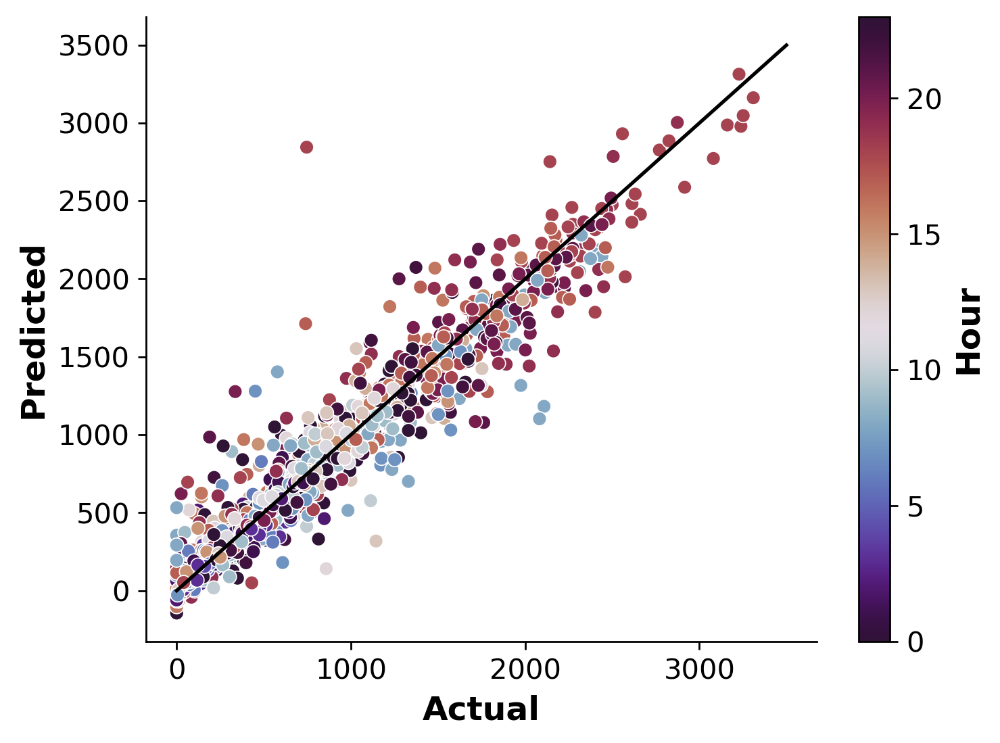

# Seoul Bike Sharing Demand Prediction
## Overview
Code and data used to model rental bike demand in Seoul, South Korea. 
Hourly demand is modelled in this case, based largely on environmental data (temperature, humidity etc.).
The idea here is for the city to already have an estimate of the next day (or week's) demand, so they can plan accordingly.

Data was obtained from [here](https://archive.ics.uci.edu/dataset/560/seoul+bike+sharing+demand), with a journal article discussing the dataset and several modelling techniques found [here](https://www.sciencedirect.com/science/article/abs/pii/S0140366419318997).

## Models

I trained two models to predict demand based on the environmental data (other variables like the hour and day of week where also included):
- Linear Regression (with regularization, feature selection and scaling).
- XGBoost (eXtreme Gradient Boosting with an ensemble of Decision Trees)

I used `GridSearchCV` from `sklearn` to estimate the optimal hyperparameters for each model. 
The best Linear Regression model achieved a mean absolute error (MAE) of 166.7, 
while the XGBoost model performed better with an MAE of 102.8 (based on the cross validation set).
Given that the mean demand between 7am and 10pm is 905, this level of error is not bad. 

Below I compare the XGBoost predictions to the real data for the **test set**:

The color of the dots represents the hour of the day. 
You can see that the highest demand is in the evening (around 6-8pm) when people are done with work.
The black line is the 1:1 line, which gives you a sense of how far the predictions are from the real data.

## Requirements 
The following packages are needed to work with this project:
- `sklearn`
- `pandas` 
- `XGBoost`
